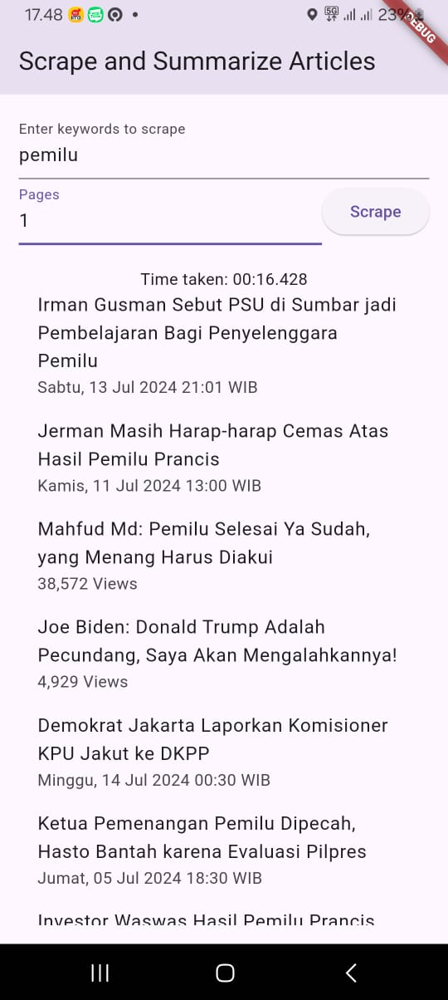

# Peringkasan Teks Menggunakan BART dengan FastAPI dan Flutter

Repositori ini berisi implementasi model peringkasan teks berbasis BART, yang di-*deploy* menggunakan FastAPI dan diintegrasikan dengan aplikasi mobile berbasis Flutter. Solusi ini dirancang untuk membantu penyandang tunanetra dengan menyediakan konten teks yang diringkas yang dapat dikonversi menjadi suara.

## Pendahuluan

Di era digital, informasi tersedia dalam jumlah yang melimpah, sehingga sulit untuk menilai kualitasnya. Bagi penyandang tunanetra, tantangan dalam mengakses dan membaca informasi menjadi lebih besar. Proyek ini bertujuan untuk mengembangkan metode peringkasan teks otomatis menggunakan model BART, yang memungkinkan pengguna untuk dengan cepat memahami isi artikel yang panjang. Selain itu, fitur text-to-speech diintegrasikan untuk membantu penyandang tunanetra mendengarkan konten yang diringkas.

## Fitur

- **Peringkasan Teks**: Menggunakan model BART untuk menghasilkan ringkasan singkat dari artikel yang panjang.
- **Backend FastAPI**: Menyediakan endpoint API untuk mengirim teks dan menerima ringkasan.
- **Aplikasi Mobile Flutter**: Antarmuka pengguna yang ramah, memungkinkan pengguna memasukkan teks dan mendengarkan konten yang diringkas.
- **Integrasi Text-to-Speech**: Mengonversi teks yang diringkas menjadi suara untuk memudahkan akses bagi penyandang tunanetra.

## Source Code
bart-summarization-final.ipynb

## Instalasi

### Menyiapkan Lingkungan

1. **Clone repositori:**
   ```bash
   git clone https://github.com/daryraa/bart.git
   cd bart
   ```

2. **Instal dependensi Python:**
   ```bash
   pip install -r requirements.txt
   ```
### Load Model
Jika ingin menggunakan model default bisa menggunakan model yang terdapat di Huggingface

1. https://huggingface.co/facebook/bart-large-cnn
2. https://huggingface.co/facebook/bart-base
  
Namun jika ingin menggunakan model yang telah di fine tune, bisa menggunakan model yang ada didalam repositori

### API Endpoints

Berikut adalah daftar endpoint yang tersedia di API ini:

#### 1. **`POST /test`**
   - **Deskripsi:** Menghasilkan ringkasan dari teks yang diberikan menggunakan model BART.
   - **Body Parameters:**
     - `text_data` (required): Teks yang akan diringkas.
       ```json
       {
         "text": "Teks lengkap yang ingin diringkas."
       }
       ```
     - `params` (optional): Parameter untuk menyesuaikan panjang ringkasan.
       ```json
       {
         "max_length": 150,
         "min_length": 50
       }
       ```
   - **Response:**
     ```json
     {
       "summary_text": "Teks yang telah diringkas."
     }
     ```

#### 2. **`GET /`**
   - **Deskripsi:** Mengembalikan pesan sederhana untuk memeriksa apakah API sedang berjalan.
   - **Response:**
     ```json
     {
       "message": "FastAPI is running"
     }
     ```

#### 3. **`GET /articles`**
   - **Deskripsi:** Mengambil daftar artikel dari Detik.com berdasarkan kata kunci yang diberikan.
   - **Query Parameters:**
     - `keywords` (required): Kata kunci untuk pencarian artikel.
     - `pages` (required): Jumlah halaman yang akan diambil.
   - **Response Model:** `List[Article]`
   - **Response Example:**
     ```json
     [
       {
         "title": "Judul Artikel",
         "published_time": "Waktu Publikasi",
         "href": "Link Artikel",
         "text": "Teks Lengkap Artikel"
       },
       ...
     ]
     ```

#### Contoh Penggunaan:

- **Meringkas Teks:**
  - Endpoint: `POST /test`
  - Request Body:
    ```json
    {
      "text": "Berikut adalah contoh teks yang ingin diringkas...",
      "max_length": 100,
      "min_length": 50
    }
    ```
  - Response:
    ```json
    {
      "summary_text": "Ini adalah ringkasan dari teks yang diberikan..."
    }
    ```

- **Memeriksa Status API:**
  - Endpoint: `GET /`
  - Response:
    ```json
    {
      "message": "FastAPI is running"
    }
    ```

- **Mengambil Artikel dari Detik.com:**
  - Endpoint: `GET /articles`
  - Query Parameters: `?keywords=politik&pages=2`
  - Response:
    ```json
    [
      {
        "title": "Judul Artikel 1",
        "published_time": "22 Juli 2024",
        "href": "https://www.detik.com/link-artikel-1",
        "text": "Isi lengkap artikel..."
      },
      {
        "title": "Judul Artikel 2",
        "published_time": "21 Juli 2024",
        "href": "https://www.detik.com/link-artikel-2",
        "text": "Isi lengkap artikel..."
      }
    ]
    ```


## **Langkah-langkah Deployment di Replit**

1. **Fork Repositori:**
   - Pertama, fork repositori yang diinginkan ke akun GitHub Anda.
   - Buka [Replit](https://replit.com/) di browser Anda.
   - Gunakan opsi "Import from GitHub" untuk mengimpor repositori yang telah di-fork ke dalam Replit.

2. **Persiapan File app.py:**
    - Pastikan bahwa file app.py adalah satu-satunya file yang dibutuhkan untuk menjalankan aplikasi FastAPI Anda.
    - File app.py harus mengandung semua logika aplikasi, termasuk inisialisasi FastAPI dan rute API yang diperlukan.

3. **Jalankan Proyek:**
   - Setelah repositori diimpor, Replit akan otomatis mendeteksi file dan lingkungan proyek.
   - Klik tombol "Run" untuk memulai aplikasi FastAPI. Replit akan menjalankan **app.py** sebagai file utama.

4. **Akses Endpoint API:**
   - Setelah proyek berjalan, Replit akan menyediakan URL di mana API dapat diakses.
   - Gunakan URL ini untuk berinteraksi dengan API melalui endpoint yang tersedia.

## Penggunaan

### Menjalankan Server FastAPI

1. **Mulai server:**
   ```bash
   uvicorn app:app --reload
   ```

## Konfigurasi Endpoint API

Aplikasi ini menggunakan FastAPI untuk scraping artikel dan perangkuman teks. Pastikan Anda telah mengonfigurasi endpoint API yang benar di dalam kode:

- **Pencarian Artikel**: Pada `_scrapeArticles` dalam `ArticleScreen`:
  
  ```dart
  final url = Uri.parse('https://your-custom-endpoint/articles?keywords=$keywords&pages=$pages');
  ```

- **Perangkuman Teks**: Pada `_summarize` dalam `SummarizationScreen`:
  
  ```dart
  final url = Uri.parse('https://your-custom-endpoint/test');
  ```

Gantilah `your-custom-endpoint` dengan URL endpoint FastAPI Anda.

Pastikan Anda mengganti placeholder `your-custom-endpoint` dengan URL endpoint FastAPI yang benar untuk memastikan aplikasi berjalan sesuai dengan yang diharapkan.

### Menjalankan Aplikasi Flutter via Vscode

1. **Jalankan aplikasi di perangkat yang terhubung:**
   ```bash
   flutter run
   ```

2. **Menggunakan Run Without Debugging**
   Arahkan cursor kepada main.dart, lalu klik kanan akan ada pilihan pilihan **Run Without Debugging**

<p align="center">
  
  
</p>

